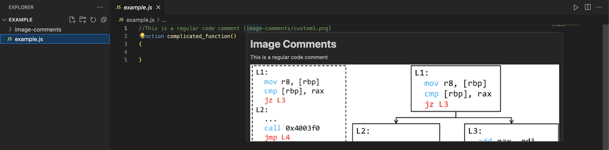

# Image Comments for Visual Studio Code

## Description

The `Image Comments` Visual Studio Code extension lets you easily add visual comments such as sketches or diagrams directly into your source code, improving code documentation and understanding.



## Features

- Supports multiple programming languages: JavaScript, Python, C++, C#
- Hover over comments to display your custom images in a tooltip
- Easy-to-use comment syntax for linking images

## Requirements

- Visual Studio Code version 1.60.0 or higher

## Installation

1. Open Visual Studio Code
2. Go to Extensions Marketplace
3. Search for "Image Comments"
4. Click the "Install" button

## Usage

Write your comment in the following format:

```plaintext
// Describes the function logic [image-comments/image1.png]
```

-Create a dedicated folder named `image-comments` within your project directory and populate it with your images.
-The comment preceding the image path will be displayed in the tooltip.
-The image path is relative to the image-comments directory in your workspace.

## Author

Maximilian Giesen
https://github.com/mgiesen
