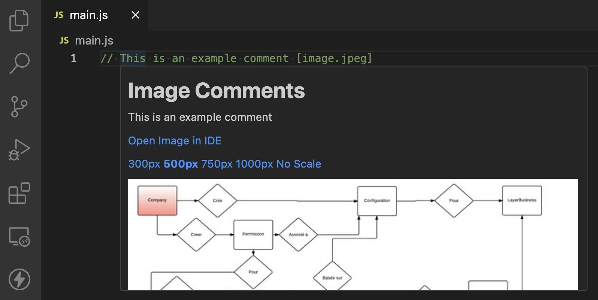

# Image Comments for Visual Studio Code


## Description

The `Image Comments` extension for Visual Studio Code allows you to add images, such as sketches or diagrams, directly into your source code. This helps to improve documentation and understanding, especially for complex algorithms. By visualizing code concepts, it makes them easier to comprehend and track over time.



## Features

- Hover over comments to display custom images in a tooltip

- Simple `[path/to/image]` syntax for linking images in comments
- Option to open images directly within the editor
- Option to scale images for a better overview
- Configurable image path mode: relative to the file or the workspace
- Paste Image from Clipboard: Right-click in the editor and select "Image Comments: Paste Image" to save an image from your clipboard directly into your workspace and insert a comment link at the cursor position (macOS & Windows)
- Configurable save directory for pasted images

## Requirements

- Visual Studio Code version 1.78.0 or higher

## Usage

### Paste Image from Clipboard

1. Copy an image file or take a screenshot
2. Right-click in the editor at the desired position and select **"Image Comments: Paste Image"**
3. A placeholder comment appears at the cursor position while the image is being processed
4. Once done, the placeholder is replaced with the final comment link (e.g. `// [image-comments/image-xxx.png]`)
5. Hover over the comment to view the image

### Manual Image Comments

- Place your image in a folder accessible relative to the source file
- Insert a comment with the image path enclosed in square brackets `[]`
- The image path can be relative to the file or the workspace (configurable)
- Hover over the comment to view the image in a tooltip

### JavaScript Example

```javascript
// Image pasted via context menu [image-comments/image-20260709-220945.png]

// Manual: image in the same folder [image.png]

// Manual: image in a subfolder [images/image.png]

/*
   Multi-line comments work too [../image.png]
*/
```

## Configuration

To modify these settings, open VS Code settings (`Cmd + ,`), search for `imageComments`, and choose your preferred options.

| Setting                       | Default          | Description                                                                                                                   |
| ----------------------------- | ---------------- | ----------------------------------------------------------------------------------------------------------------------------- |
| `imageComments.pathMode`      | `relativeToFile` | `relativeToFile`: image paths relative to the source file. `relativeToWorkspace`: image paths relative to the workspace root. |
| `imageComments.saveDirectory` | `image-comments` | Directory where pasted images are saved, relative to the workspace root.                                                      |

## Installation

1. Open Visual Studio Code
2. Go to Extensions Marketplace
3. Search for "Image Comments"
4. Click "Install"

Or install directly from the [marketplace](https://marketplace.visualstudio.com/items?itemName=mgiesen.image-comments&ssr=false#review-details).

## Supported File Types

- C
- Clojure
- CoffeeScript
- C++
- C#
- CSS
- Dart
- Elixir
- F#
- Go
- Groovy
- Haskell
- HTML
- Java
- JavaScript
- JSON with Comments (jsonc)
- Kotlin
- Less
- Lua
- MATLAB
- Objective-C
- OCaml
- Perl
- PHP
- PowerShell
- Python
- R
- Ruby
- Rust
- Sass
- Scala
- SCSS
- Shell Script
- SQL
- Swift
- TypeScript
- YAML
- Vue
- Odin
- GLSL

## Limitations

Due to the limitations of Visual Studio Code, it is not possible to display images directly in the code. Therefore, this extension uses the solution of visualization via tooltips. The usage and styling of tooltips are also severely restricted. We do our best to always utilize all possibilities provided by Microsoft.

## Development

```bash
npm install   # install dev dependencies
npm test      # run unit tests (Node built-in test runner)
npm run package  # build the .vsix
```

To debug, open the project in VS Code and press `F5` to launch an Extension Development Host.

## Reporting Issues

If you encounter any problems or have suggestions, please open an issue on our GitHub [repository](https://github.com/mgiesen/Image-Comments).

## Contributing to This Project

We encourage contributions to this project and welcome collaborators who are interested in enhancing its functionality and features. Instead of forking and creating redundant versions, please consider submitting pull requests with your improvements. By working together, we can maintain a single, robust version of the project and ensure that all users benefit from the collective effort. Your contributions are highly valued and can make a significant impact on the project's success. Thank you for supporting the open-source community!

## Author

Maximilian Giesen  
https://github.com/mgiesen
