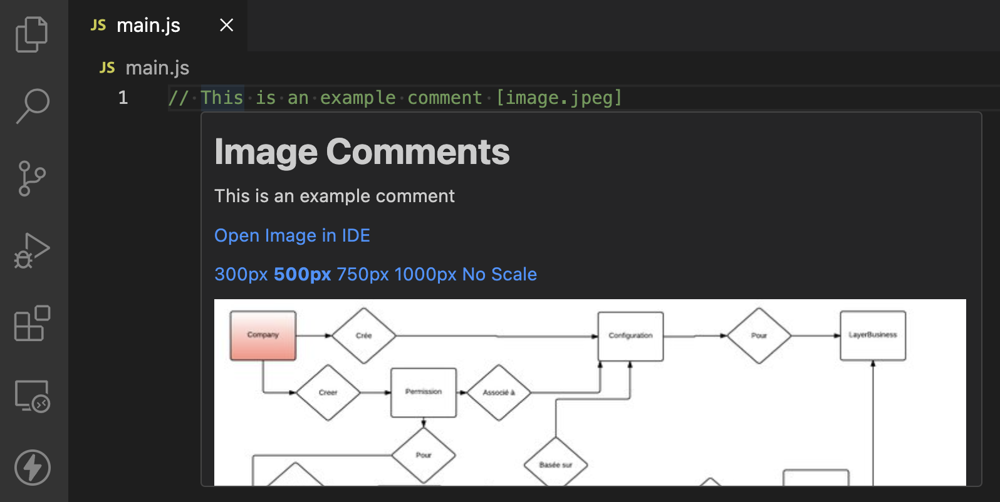

# Image Comments for Visual Studio Code

## Description

The `Image Comments` Visual Studio Code extension lets you easily add visual comments such as sketches or diagrams directly into your source code, improving code documentation and understanding.



## Features

- Hover over image comments to display your custom images in a tooltip
- Easy-to-use comment syntax for linking images
- Supports most programming languages:
  - JavaScript
  - Python
  - C++
  - C#
  - SQL
  - TypeScript
  - TypeScriptReact
  - PHP
  - Java
  - Ruby
  - Go
  - Swift
  - Kotlin
  - Perl
  - R
  - ShellScript
  - Lua
  - Groovy
  - PowerShell
  - Rust
  - Dart
  - Haskell
  - Elixir

## Requirements

- Visual Studio Code version 1.60.0 or higher

## Installation

1. Open Visual Studio Code
2. Go to Extensions Marketplace
3. Search for "Image Comments"
4. Click the "Install" button

Or just install the extension from [marketplace](https://marketplace.visualstudio.com/items?itemName=mgiesen.image-comments&ssr=false#review-details).

## Usage

- Place your image in the project folder and note it's file path relative to the project root.
- Insert a standard comment into your code.
- Append the relative image path to the comment, enclosed in square brackets.
- Hover over the comment to view the image directly within your IDE.

JavaScript Example:

```js
// Functional comment [image-comments/image1.png]
```

Python Example:

```Python
# Functional comment [image-comments/image1.png]
```

SQL Example:

```sql
-- Functional comment [image-comments/image1.png]
```

## Contributing to This Project

We encourage contributions to this project and welcome collaborators who are interested in enhancing its functionality and features. Instead of forking and creating redundant versions, please consider submitting pull requests with your improvements. By working together, we can maintain a single, robust version of the project and ensure that all users benefit from the collective effort. Your contributions are highly valued and can make a significant impact on the project’s success. Thank you for supporting the open-source community!

## Author

Maximilian Giesen  
https://github.com/mgiesen
